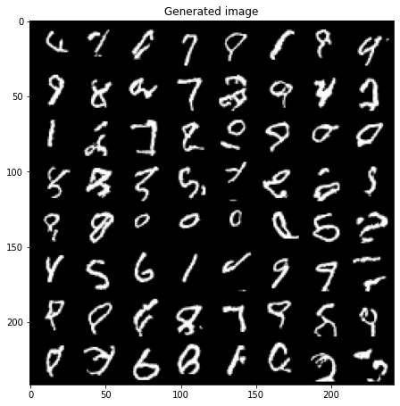

## PixelCNN 

This is an implementation based on the paper <a href="https://arxiv.org/pdf/1601.06759.pdf">Pixel Recurrent Neural Networks</a>

An auregressive model that predict pixel intensity value based on previous pixels's intensity value

 

### Result after training 25 epochs on MNIST. On CIFAR, the result is not as expected (TODO).

 

### TODO
- [x] Train on MNIST
- [ ] train on CIFAR